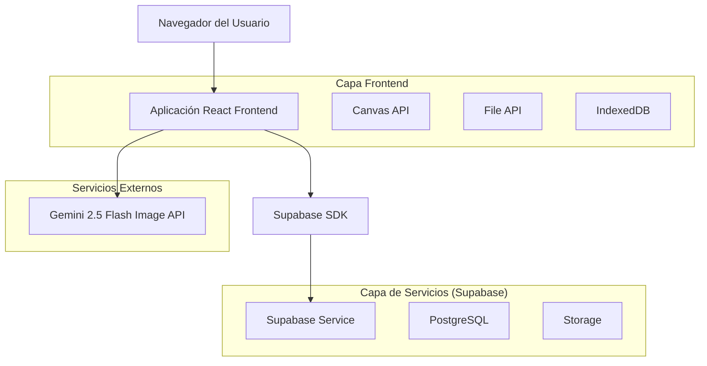
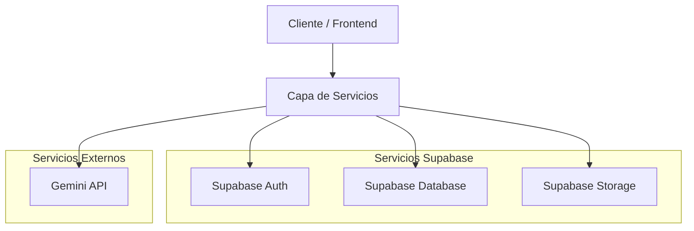
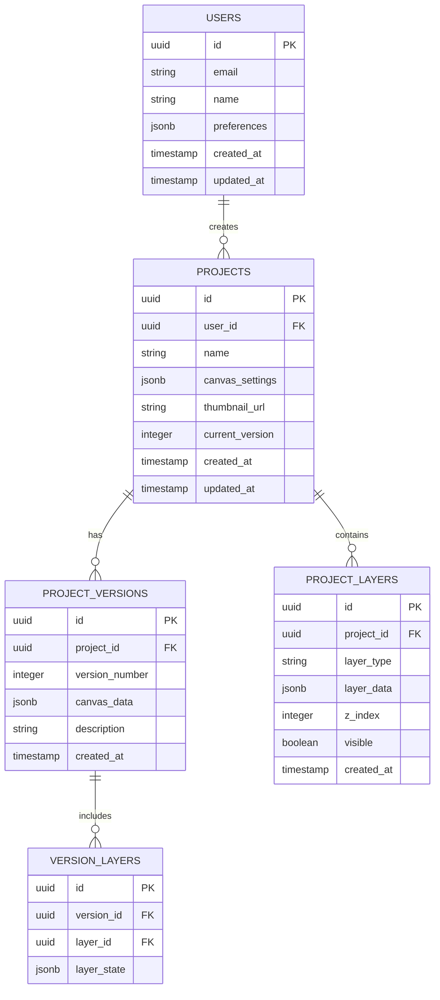

# Documento de Arquitectura Técnica - Lienzo + Gemini 2.5 Flash Image

## 1. Diseño de Arquitectura



## 2. Descripción de Tecnologías

* Frontend: React\@18 + TypeScript + Tailwind CSS\@3 + Vite

* Canvas: Fabric.js para manipulación avanzada de canvas

* Backend: Supabase (autenticación, base de datos, almacenamiento)

* IA: Gemini 2.5 Flash Image API

* Almacenamiento local: IndexedDB para cache de imágenes y historial

## 3. Definiciones de Rutas

| Ruta         | Propósito                                             |
| ------------ | ----------------------------------------------------- |
| /            | Página principal con lienzo y herramientas de edición |
| /settings    | Configuración de usuario y preferencias de API        |
| /gallery     | Galería de proyectos guardados e historial            |
| /project/:id | Carga de proyecto específico desde la galería         |

## 4. Definiciones de API

### 4.1 API Principal

#### Integración con Gemini 2.5 Flash Image

```typescript
// Tipos de datos para la integración con Gemini
interface GeminiImageRequest {
  mode: 'generate' | 'edit';
  user_prompt: string;
  base_image?: Blob | null;
  mask_image?: Blob | null;
  reference_images?: Blob[];
  edit_strength: number; // 0.0-1.0
  preservation_bias: 'low' | 'med' | 'high';
  character_consistency: 'low' | 'med' | 'high';
  seed?: number | null;
  quality_vs_speed: 'fast' | 'balanced' | 'high';
}

interface GeminiImageResponse {
  image: Blob; // PNG/WEBP
  brief_note: string;
  success: boolean;
  error?: string;
}
```

#### API de Gestión de Proyectos

```
POST /api/projects
```

Request:

| Nombre Parámetro | Tipo Parámetro | Requerido | Descripción                   |
| ---------------- | -------------- | --------- | ----------------------------- |
| name             | string         | true      | Nombre del proyecto           |
| canvas\_data     | object         | true      | Datos serializados del canvas |
| thumbnail        | string         | false     | URL de miniatura base64       |

Response:

| Nombre Parámetro | Tipo Parámetro | Descripción           |
| ---------------- | -------------- | --------------------- |
| id               | string         | ID único del proyecto |
| created\_at      | string         | Timestamp de creación |

```
GET /api/projects
```

Response:

| Nombre Parámetro | Tipo Parámetro | Descripción                    |
| ---------------- | -------------- | ------------------------------ |
| projects         | array          | Lista de proyectos del usuario |

```
PUT /api/projects/:id
```

Request:

| Nombre Parámetro | Tipo Parámetro | Requerido | Descripción                   |
| ---------------- | -------------- | --------- | ----------------------------- |
| canvas\_data     | object         | true      | Datos actualizados del canvas |
| version          | number         | true      | Número de versión             |

## 5. Diagrama de Arquitectura del Servidor



## 6. Modelo de Datos

### 6.1 Definición del Modelo de Datos



### 6.2 Lenguaje de Definición de Datos

#### Tabla de Usuarios (users)

```sql
-- Crear tabla de usuarios
CREATE TABLE users (
    id UUID PRIMARY KEY DEFAULT gen_random_uuid(),
    email VARCHAR(255) UNIQUE NOT NULL,
    name VARCHAR(100) NOT NULL,
    preferences JSONB DEFAULT '{}',
    created_at TIMESTAMP WITH TIME ZONE DEFAULT NOW(),
    updated_at TIMESTAMP WITH TIME ZONE DEFAULT NOW()
);

-- Políticas RLS para usuarios
ALTER TABLE users ENABLE ROW LEVEL SECURITY;
CREATE POLICY "Users can view own profile" ON users FOR SELECT USING (auth.uid() = id);
CREATE POLICY "Users can update own profile" ON users FOR UPDATE USING (auth.uid() = id);
```

#### Tabla de Proyectos (projects)

```sql
-- Crear tabla de proyectos
CREATE TABLE projects (
    id UUID PRIMARY KEY DEFAULT gen_random_uuid(),
    user_id UUID REFERENCES users(id) ON DELETE CASCADE,
    name VARCHAR(255) NOT NULL,
    canvas_settings JSONB DEFAULT '{}',
    thumbnail_url TEXT,
    current_version INTEGER DEFAULT 1,
    created_at TIMESTAMP WITH TIME ZONE DEFAULT NOW(),
    updated_at TIMESTAMP WITH TIME ZONE DEFAULT NOW()
);

-- Índices
CREATE INDEX idx_projects_user_id ON projects(user_id);
CREATE INDEX idx_projects_created_at ON projects(created_at DESC);

-- Políticas RLS
ALTER TABLE projects ENABLE ROW LEVEL SECURITY;
CREATE POLICY "Users can manage own projects" ON projects FOR ALL USING (auth.uid() = user_id);
```

#### Tabla de Versiones de Proyecto (project\_versions)

```sql
-- Crear tabla de versiones
CREATE TABLE project_versions (
    id UUID PRIMARY KEY DEFAULT gen_random_uuid(),
    project_id UUID REFERENCES projects(id) ON DELETE CASCADE,
    version_number INTEGER NOT NULL,
    canvas_data JSONB NOT NULL,
    description TEXT,
    created_at TIMESTAMP WITH TIME ZONE DEFAULT NOW()
);

-- Índices
CREATE INDEX idx_project_versions_project_id ON project_versions(project_id);
CREATE INDEX idx_project_versions_version ON project_versions(project_id, version_number);

-- Políticas RLS
ALTER TABLE project_versions ENABLE ROW LEVEL SECURITY;
CREATE POLICY "Users can manage versions of own projects" ON project_versions FOR ALL 
USING (EXISTS (SELECT 1 FROM projects WHERE projects.id = project_versions.project_id AND projects.user_id = auth.uid()));
```

#### Tabla de Capas de Proyecto (project\_layers)

```sql
-- Crear tabla de capas
CREATE TABLE project_layers (
    id UUID PRIMARY KEY DEFAULT gen_random_uuid(),
    project_id UUID REFERENCES projects(id) ON DELETE CASCADE,
    layer_type VARCHAR(50) NOT NULL CHECK (layer_type IN ('base', 'mask', 'result', 'reference')),
    layer_data JSONB NOT NULL,
    z_index INTEGER DEFAULT 0,
    visible BOOLEAN DEFAULT true,
    created_at TIMESTAMP WITH TIME ZONE DEFAULT NOW()
);

-- Índices
CREATE INDEX idx_project_layers_project_id ON project_layers(project_id);
CREATE INDEX idx_project_layers_z_index ON project_layers(project_id, z_index);

-- Políticas RLS
ALTER TABLE project_layers ENABLE ROW LEVEL SECURITY;
CREATE POLICY "Users can manage layers of own projects" ON project_layers FOR ALL 
USING (EXISTS (SELECT 1 FROM projects WHERE projects.id = project_layers.project_id AND projects.user_id = auth.uid()));
```

#### Permisos básicos

```sql
-- Conceder permisos básicos al rol anon para lectura
GRANT SELECT ON users TO anon;
GRANT SELECT ON projects TO anon;
GRANT SELECT ON project_versions TO anon;
GRANT SELECT ON project_layers TO anon;

-- Conceder permisos completos al rol authenticated
GRANT ALL PRIVILEGES ON users TO authenticated;
GRANT ALL PRIVILEGES ON projects TO authenticated;
GRANT ALL PRIVILEGES ON project_versions TO authenticated;
GRANT ALL PRIVILEGES ON project_layers TO authenticated;
```

#### Datos iniciales

```sql
-- Insertar configuraciones por defecto
INSERT INTO users (email, name, preferences) VALUES 
('demo@example.com', 'Usuario Demo', '{
  "canvas_size": {"width": 1024, "height": 1024},
  "default_brush_size": 10,
  "auto_save": true,
  "quality_preference": "balanced"
}');
```

