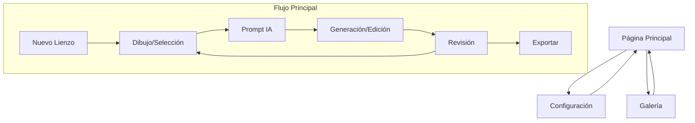

# Documento de Requisitos del Producto - Lienzo + Gemini 2.5 Flash Image (Nano Banana)

## 1. Visión General del Producto

Aplicación de lienzo avanzada que combina dibujo manual tradicional con generación y edición de imágenes asistida por IA usando Gemini 2.5 Flash Image ("Nano Banana"). Permite crear imágenes desde texto, editar por zonas específicas sin alterar el resto de la imagen, y fusionar múltiples referencias manteniendo consistencia visual.

El producto resuelve la necesidad de artistas digitales y creadores de contenido de tener control granular sobre la edición de imágenes con IA, preservando elementos específicos mientras modifican otros de manera precisa.

## 2. Características Principales

### 2.1 Roles de Usuario

| Rol | Método de Registro | Permisos Principales |
|-----|-------------------|---------------------|
| Usuario Estándar | Registro por email | Acceso completo a todas las funciones de dibujo y edición con IA |

### 2.2 Módulo de Características

Nuestra aplicación de lienzo con IA consta de las siguientes páginas principales:

1. **Página Principal**: área de trabajo con lienzo multicapa, paneles de herramientas y controles de IA.
2. **Página de Configuración**: ajustes de usuario, preferencias de calidad y configuración de API.
3. **Página de Galería**: historial de proyectos, versiones guardadas y comparaciones A/B.

### 2.3 Detalles de Páginas

| Nombre de Página | Nombre del Módulo | Descripción de Características |
|------------------|-------------------|--------------------------------|
| Página Principal | Panel de Herramientas Izquierdo | Pincel con tamaños variables, goma de borrar, herramienta de lazo, selección rectangular, visualización de máscara actual |
| Página Principal | Área Central de Lienzo | Canvas multicapa (Base, Máscara, Resultado), zoom y navegación, superposición de capas con transparencia |
| Página Principal | Panel de Control Derecho | Campo de texto para prompts, selector de modo (Generar/Editar), carga de imágenes de referencia, parámetros ajustables (fuerza, consistencia, tamaño) |
| Página Principal | Barra de Acciones | Botones Generar, Editar según máscara, Fusionar referencias, Revertir, Guardar, Exportar |
| Página Principal | Control de Historial | Undo/Redo con vista previa, comparador A/B con deslizador, versionado por capas |
| Página Configuración | Configuración de API | Configuración de claves API de Gemini, ajustes de calidad vs velocidad por defecto |
| Página Configuración | Preferencias de Usuario | Configuración de formatos de exportación, avisos de SynthID, atajos de teclado |
| Página Galería | Historial de Proyectos | Lista de proyectos guardados con miniaturas, búsqueda y filtrado por fecha |
| Página Galería | Comparación de Versiones | Vista lado a lado de diferentes versiones, herramientas de comparación A/B |

## 3. Proceso Principal

### Flujo de Usuario Principal

1. **Creación/Carga**: El usuario inicia un nuevo lienzo o carga una imagen existente
2. **Dibujo Manual**: Utiliza herramientas tradicionales (pincel, goma, selección) para crear trazos o máscaras
3. **Generación con IA**: Ingresa prompts de texto para generar imágenes desde cero o editar áreas específicas
4. **Edición Localizada**: Aplica cambios solo en áreas marcadas por máscaras, preservando el resto
5. **Fusión de Referencias**: Integra elementos de imágenes de referencia manteniendo consistencia
6. **Refinamiento**: Ajusta parámetros (fuerza, consistencia) y utiliza historial para comparar versiones
7. **Exportación**: Guarda el resultado final con aviso de marca de agua SynthID

## 4. Diseño de Interfaz de Usuario

### 4.1 Estilo de Diseño

- **Colores primarios**: Gris oscuro (#2D2D2D) para fondo, Azul (#007ACC) para elementos activos
- **Colores secundarios**: Gris claro (#F5F5F5) para paneles, Verde (#28A745) para confirmaciones
- **Estilo de botones**: Redondeados con sombras sutiles, estados hover y active claramente diferenciados
- **Tipografía**: Inter 14px para texto general, 16px para títulos de sección, 12px para etiquetas
- **Estilo de layout**: Diseño de tres paneles con separadores redimensionables
- **Iconos**: Estilo minimalista con líneas finas, consistente con Feather Icons

### 4.2 Resumen de Diseño de Páginas

| Nombre de Página | Nombre del Módulo | Elementos de UI |
|------------------|-------------------|----------------|
| Página Principal | Panel Izquierdo | Barra vertical con iconos de herramientas, selector de tamaño de pincel, paleta de colores básica |
| Página Principal | Área Central | Canvas responsivo con controles de zoom, indicadores de capa, reglas opcionales |
| Página Principal | Panel Derecho | Textarea para prompts, dropdown de modos, área de drag-and-drop para referencias, sliders para parámetros |
| Configuración | Panel de Configuración | Formulario con campos de texto para API keys, toggles para opciones, sliders para valores por defecto |
| Galería | Grid de Proyectos | Cards con miniaturas, títulos, fechas, botones de acción (abrir, duplicar, eliminar) |

### 4.3 Responsividad

La aplicación está diseñada desktop-first con adaptación para tablets. Los paneles laterales se colapsan en pantallas menores a 1024px, mostrándose como overlays. Se incluye optimización para interacción táctil en dispositivos compatibles.